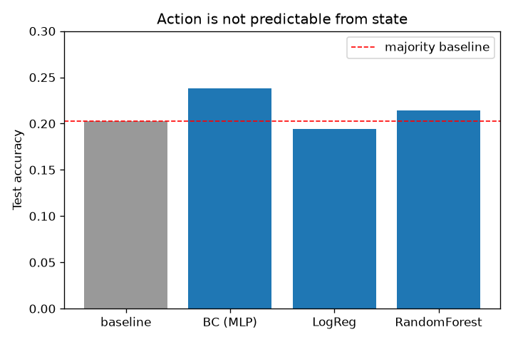
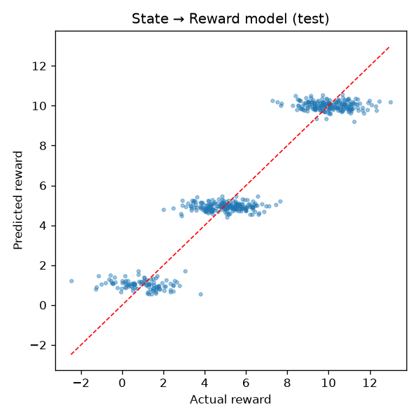

# Offline RL for Decision Optimization on Real-World Sensor/System Logs

An end-to-end **offline reinforcement-learning pipeline** built on logged
multi-sensor decision data, paired with a **rigorous learnability / off-policy
evaluation study** that asks the question most RL projects skip: *is this
problem actually solvable from the data we have?*

> **Headline result.** The pipeline ingests six logged data streams into
> `(state, action, reward, next_state)` transitions and trains a behaviour-cloning
> policy. A learnability study then shows the logged controller acted **near-randomly**
> and that **actions have no measurable effect on reward** — so no reward-improving
> policy exists for this dataset. The valid, deliverable artefact is a
> **state → reward outcome model achieving R² = 0.92**, alongside a clear, evidence-based
> diagnosis. Knowing *when not to trust an RL result* is the point.

## Why this framing

It is easy to report "my RL agent got 22% accuracy" and move on. The harder,
more valuable engineering question is whether the logged data contains a signal
an agent could ever exploit. This project answers that with three controlled probes
and lets the evidence drive the conclusion — exactly the diligence needed before
deploying a learned policy on real-world (here, sensor/defence-style) systems.

## The data

Six logged streams of 3,000 timesteps each (train/validation/test splits),
merged on `timestamp`:

| Stream | Example fields |
|---|---|
| `sensor_readings` | radar_signal_strength, sonar_distance, infrared_temperature |
| `system_states` | power_level, system_health, operational_mode, cpu/memory_usage |
| `environmental_conditions` | weather, terrain, signal_interference, temperature, humidity |
| `algorithmic_outputs` | target_identification, threat_level, navigation_instruction |
| `action_logs` | **action_taken** (5 classes), action_result, duration |
| `reward_signals` | **reward** (continuous) |

## Pipeline

```
6 logged streams ─► merge on timestamp ─► encode categoricals ─► standardise
        ─► build (state, action, reward, next_state) transitions
        ─► [A] behaviour-cloning policy (PyTorch MLP)
        ─► [B] learnability study: action↔state, reward↔state, reward↔action
        ─► state→reward outcome model + diagnosis
```

Engineering details that matter:
- **Leakage control** — `action_result` and `duration` are recorded *after* the
  action, so they're excluded from the state when predicting the action.
- **All six streams used** (the original exploration merged only four), giving a
  16-feature state.
- **Train-fit encoders & scaler** applied to test (no test leakage); unseen
  categories handled gracefully.

## Results

All numbers are on the held-out test split, reproducible via `src/offline_rl.py`.

**1. Behaviour cloning can't beat chance — because the action isn't in the state.**

| Predict `action_taken` from state | Test accuracy |
|---|---|
| Majority-class baseline | 0.203 |
| Behaviour cloning (PyTorch MLP) | 0.238 |
| Logistic Regression | 0.194 |
| Random Forest (300 trees) | 0.214 |

Three different model families all land at ~0.20 → the logged policy is
**uninformative w.r.t. state**.



**2. Reward is highly predictable from state — but actions don't move it.**

| Predict `reward` | Test R² |
|---|---|
| from **state** | **0.917** |
| from **state + action** | 0.917 (Δ **+0.000**) |

Adding the action contributes nothing → **actions are reward-neutral** in this data.



**Conclusion:** there is no decision to optimise in this dataset. The honest,
useful outputs are (a) the **R²=0.92 state→reward model** and (b) the
**diagnostic finding** that this logged data cannot support a control policy.

## Repository structure

```
src/offline_rl.py        clean, reusable pipeline + learnability study (run this)
Offline_..._Data.ipynb   original exploratory notebook
assets/                  generated figures used in this README
*_train/validation/test.csv   the six logged data streams
requirements.txt
```

## Run it

```bash
python -m venv .venv && source .venv/bin/activate
pip install -r requirements.txt
python src/offline_rl.py --data-dir .
```

Prints the dataset summary, the learnability study, and the conclusion, and
regenerates the figures in `assets/`.

## Tech stack

Python · pandas · scikit-learn · **PyTorch** · matplotlib

## Limitations & next steps

- This dataset is synthetic and, as shown, lacks an action→reward signal. To
  demonstrate a reward-*improving* agent, the natural next step is a dataset with
  genuine action→outcome dependence, then applying conservative offline-RL
  algorithms (CQL/IQL via `d3rlpy`) and **off-policy evaluation** (FQE,
  importance sampling) to estimate the learned policy's value safely.
- The state→reward model could be deployed as an outcome predictor /
  early-warning signal even without a control policy.
